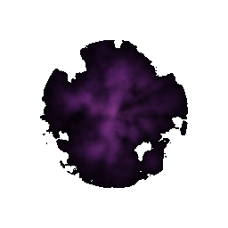
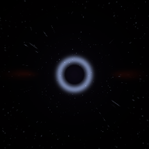
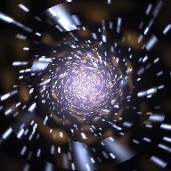
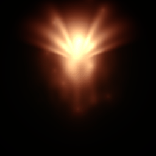
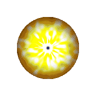
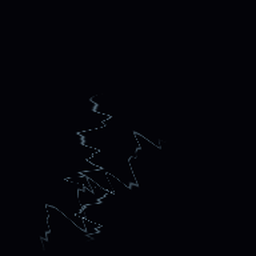
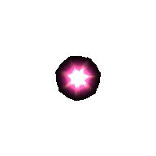
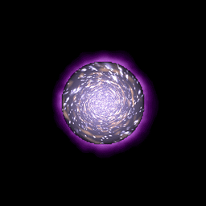

# ShaderBrew

Professional WebGL procedural texture generator. Multi-layer compositing, PBR map generation, 3D material preview, 52 custom GLSL shaders, and 65+ procedural effects — all running in your browser with zero dependencies.

**[Live Showcase](https://web3dev1337.github.io/shaderbrew/showcase.html)** | **[Open Editor](https://web3dev1337.github.io/shaderbrew/editor.html)**

---

## What It Does

The **[Showcase](https://web3dev1337.github.io/shaderbrew/showcase.html)** walks through the full pipeline in 7 chapters:

| Chapter | What You See |
|---------|-------------|
| **Raw Canvas** | 65+ procedural effects — explosions, corona, caustics, frozen lightning |
| **Color Balance** | RGB channel shifting on raw effects |
| **Gradient Mapping** | One explosion through 10 different color palettes |
| **Multi-Layer Compositing** | Organic caustics + digital matrix blended with 9 modes |
| **Combination** | Full chains — two effects blended and gradient-mapped |
| **PBR Maps** | Auto-generated Normal, Roughness, AO, Metallic from any texture |
| **3D Preview** | PBR materials applied to lit, rotating geometry in real-time |

The hero demo builds a **Dark Ritual Portal** from scratch — layering a raymarched warp tunnel with a sprite ring and alpha compositing it into a final effect.

---

## Custom GLSL Shaders

52 hand-written fragment shaders — raymarched volumes, fractals, portals, and cosmic phenomena:

<p align="center">





</p>
<p align="center">



</p>

The showcase features 12 of these live — Volumetric Nebula, Black Hole, Cosmic Jellyfish, God Rays, Reality Shatter, Dimensional Portal, Time Vortex, Particle Collider, Void Tendril, and Summoning Circle among them.

---

## Pages

| Page | Description |
|------|-------------|
| **[Showcase](https://web3dev1337.github.io/shaderbrew/showcase.html)** | Guided tour — 7 chapters, live renders, PBR pipeline walkthrough |
| **[Editor](https://web3dev1337.github.io/shaderbrew/editor.html)** | Full texture editor — layers, gradients, PBR export, undo/redo |
| **[Gallery](https://web3dev1337.github.io/shaderbrew/gallery.html)** | Live animated gallery of 70+ procedural effects |
| **[Material Forge](https://web3dev1337.github.io/shaderbrew/demos.html)** | 3D material demo — textures on lit spinning objects with bloom |
| **[Sprite Gallery](https://web3dev1337.github.io/shaderbrew/sprite-gallery.html)** | 119 animated sprite sheets (FXGEN + custom GLSL) |
| **[Particles](https://web3dev1337.github.io/shaderbrew/particles.html)** | 3D particle viewport with sprite-sheet effects |

---

## Features

### Editor
- **65+ procedural effect types** — explosions, fire, plasma, voronoi, fractals, caustics
- **52 custom GLSL shaders** — raymarched nebulae, black holes, warp tunnels, fractals
- **Multi-layer compositing** — unlimited layers with 9 blend modes
- **Gradient color mapping** — multi-stop gradient editor with 5 presets
- **PBR map generation** — Normal, Roughness, AO, Metallic
- **3D material preview** — real-time on sphere/cube/torus knot with environment reflections
- **Undo/Redo** — 50-state history (Ctrl+Z / Ctrl+Shift+Z)
- **Export** — PNG, JPEG, ZIP bundles with all PBR maps, up to 2048x2048

### Sprite Sheets
- **119 pre-rendered sprite sheets** — 6x6 grid, 36 frames each
- **Game-ready** — transparent PNGs with alpha for particle systems and VFX

---

## Tech Stack

- **Three.js** 0.174.0 — WebGL rendering, 3D preview, PBR materials
- **pixy shader library** — 65+ procedural effect fragment shaders
- **Custom GLSL** — 52 hand-written shaders bypassing pixy entirely
- **lil-gui** — parameter controls
- **JSZip** — ZIP export (loaded on demand)
- No build step, no bundler — pure ES modules served directly

## Running Locally

```bash
git clone https://github.com/web3dev1337/shaderbrew.git
cd shaderbrew
python3 -m http.server 4444
# Open http://localhost:4444/showcase.html
```

## Credits

Uses [pixy.js](https://github.com/mebiusbox/pixy.js) by [mebiusbox](https://github.com/mebiusbox) (MIT License) — the procedural shader library that powers the 65+ built-in effect types.

Everything else (editor, layers, compositing, gradient mapping, PBR generation, 3D preview, 52 custom GLSL shaders, sprite sheets, showcase, material forge) is original ShaderBrew code.

## License

MIT — see [LICENSE](LICENSE) for details.
